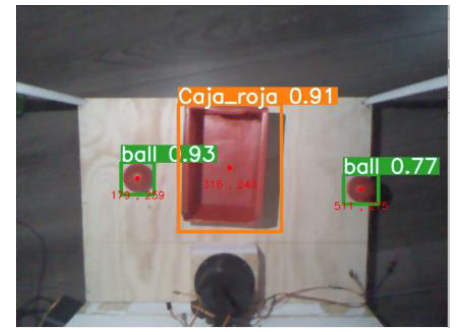

# HEBRASC
5-dof Automated robotic arm (cobot) that is intended to be an economic tool that introduces new students to the field, targeting schools with lower income which performs multiple task thanks to an artificial vision system with multiple object detction and depth estimation, acquiring rgbd images from a 360 Kinect sensor and processing them with a Raspberry Pi 4. Developed in Python with Pytorch, OpenCV and Yolov7.

My Environment OS: Raspberry Pi OS Python: 3.8.12 PyTorch: 1.13.0 OpenCV-Python: 4.6.0 

# Vision

  

  
  # Model/Arm

  

  

  
  # More details
  -Matlab 3d Visualisation:
  
*Cyan link= Base

*Black link= Hombro/shoulder

*Yellow link= Codo/elbow

*Purple link= Muñeca-efector final/wrist-end effector

   
  
  
  
 
  
 
  
-Model Precision
 
