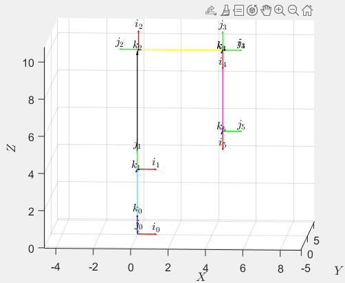

# HEBRASC
5-dof Automated robotic arm (cobot) supported by an artificial vision system with multiple object detction and depth estimation, acquiring the images with a Kinect sensor and processing them with a Raspberry Pi 4. Developed in Python with Pytorch, OpenCV and Yolov7

My Environment OS: Raspberry Pi OS Python: 3.8.12 PyTorch: 1.13.0 OpenCV-Python: 4.6.0 

# Vision

  

  
  # Model/Arm

  

  

  
  # More details
  -Matlab 3d Visualisation:
  
  *cyan link=base
  
  *black link=shoulder
  
  *yellow link=elbow
  
  *purple link=wrist/end effector

   
  
  
  
 
  
 
  
-Model Precision
 
